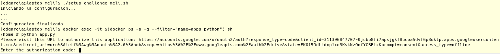
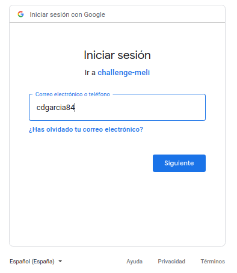
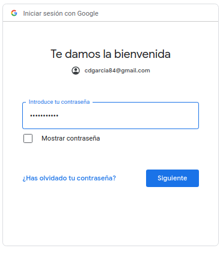
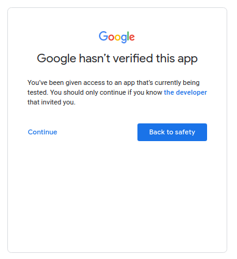
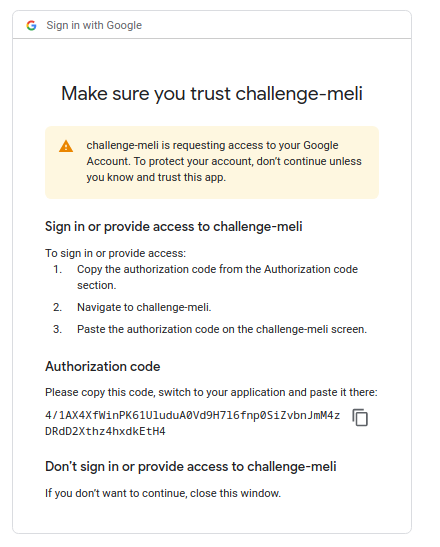

# Mercado Libre
---
## Inventariar en una Base de Datos todos los archivos pertenecientes a la unidad de Google Drive de un usuario.

## Prerequisitos
Tener correctamente instalado y ejecutando docker y docker-compose

Para reproducir el challenge tenemos que seguir los siguientes pasos.

Clonar el proyecto

```bash
git clone https://github.com/cdgarcia84/challenge-meli.git challenge-meli
```

A continuacion ejecutar el script de inicializacion
```bash
cd challenge-meli
./setup_challenge_meli.sh
```

_Nota: si se cuenta con mas de una ip asignada a la interface de red, reemplazar la primera linea del script anterior con_ 

_**docker swarm init \-\-advertise-addr (dir\_ip)**_

Terminada la inicializacion, ejecutamos
```bash
docker exec -it $(docker ps -a -q --filter="name=apps_python") sh
```

y una vez dentro del contenedor
```bash
python app.py
```

A continuacion se dara un ejemplo de uso de app.py

> Daremos permisos para usar la api de google drive

> 1.Abrir la url que aparece a continuacion en un navegador web

> 

> 2.Autenticarse con la cuenta que se desee 

> 

> 

> 3.Continuar la advertencia de seguridad

> 

> 

> 4.Copiar el codigo de autorizacion y pegarlo en prompt de la imagen 1

> 

> 5.Repetir los pasos anteriores con la finalidad de autorizar el envio de correo por medio de la api de gmail


> _en caso de querer utilizar otro usuario borrar los archivos_

> _token\_drive.json_

> _token\_gmail.json_


Finalizada la prueba, para eliminar todo lo relacionado al challenge ejecutar
```bash
./delete_challenge_meli.sh
```
_Nota: este script fuerza el borrado del swarm de docker, con lo que si se tiene algo mas corriendo y es el unico nodo, se borrara igual. De ser asi, solo usar el comando_ 

_**docker stack rm apps**_

---

## Documentacion consultada
- [API Drive]
- [API Gmail]
- [Scopes de google]
- [Ejemplo de uso de APIs con Python]
- [Activacion de API en google cloud]
- [Documentacion de Docker Compose]
- [Documentacion de Docker]
- [Documentacion de Imagen de Mariadb en DockerHub]
- [Wiki de Alpine]
- [Documentacion de Python]
- [Documentacion de mysql-connector]
- [Ejemplo de uso de mysql-connector]

[API Drive]: https://developers.google.com/drive/api/quickstart/python
[API Gmail]: https://developers.google.com/gmail/api/quickstart/python
[Scopes de google]: https://developers.google.com/identity/protocols/oauth2/scopes
[Ejemplo de uso de APIs con Python]: https://developers.google.com/resources/api-libraries/documentation/drive/v3/python/latest/index.html
[Activacion de API en google cloud]: https://www.iperiusbackup.net/es/activar-la-api-de-google-drive-y-obtener-las-credenciales-para-la-copia-de-seguridad/
[Documentacion de Docker Compose]: https://docs.docker.com/compose/
[Documentacion de Docker]: https://docs.docker.com/engine/reference/commandline/docker/
[Documentacion de Imagen de Mariadb en DockerHub]: https://hub.docker.com/_/mariadb
[Wiki de Alpine]: https://wiki.alpinelinux.org/wiki/Main_Page
[Documentacion de Python]: https://docs.python.org/3/
[Documentacion de mysql-connector]: https://pypi.org/project/mysql-connector-python/
[Ejemplo de uso de mysql-connector]: https://mariadb.com/resources/blog/how-to-connect-python-programs-to-mariadb/

